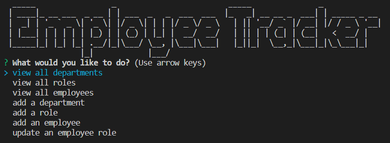

# Employee Manager

## Description

The motivation behind this project was to solidify my knowledge of SQL databases. I was to build a terminal-based app using my knowledge of Javascript, SQL, Node, and Inquirer. Additionaly, this challenge introduced me to the concepts of database drivers, query sanitation, and ascii art generators. Understanding how to use mysql2 to connect to the database and environment variables, were crucial for completing this project. 

Link to walkthrough [video](https://drive.google.com/file/d/1yBMq8BAtkA2cVKqmzAlSwL9X2fW2K2Nx/view).

Throughout the development of this project, I gained valuable insights into the following areas:
  
- **SQL Proficiency and Database Management**: Using MySQL has significantly enhanced my ability to write complex queries and database operations. I have become familiar SQL syntax and principles, which I applied to create, modify, and query a database effectively. This ensures that my future APIs depend on databases with robust and reliable architecture. This experience solidified my grasp on schemas, database management, and best practices.
  
- **mysql2 for Database Connectivity**: Using mysql2 has allowed me to understand the concept of a database driver for a relational database. Using mysql2 enabled me to establish a connection between my JavaScript code and the MySQL database. This skill is crucial for executing SQL commands through my application rather than through the MySQL shell or Workbench. Drivers like mysql2 allow me to combine Node.js with a relational database.
  
- **Node.js and Server-Side JavaScript**: Using Node.js has allowed me to create a server-side run environment for JavaScript. Thus, Node.js allows me to use JavaScript not just for front-end but also for back-end development. Also, I have gained a deeper understanding of the non-blocking I/O model that Node.js employs. This knowledge is useful for creating web applications that can handle several operations at the same time.
  
- **Node Package Manager (NPM) and Dependency Management**: I expanded my knowledge of NPM's intricacies and my proficiency in managing project dependencies. This ensures that my project is built on a solid foundation and remains up-to-date with the latest features and security patches.

- **Environment Variables for Secure Configurations**: Making use of environment variables in Node.js allowed me to securely store sensitive information like database credentials. This ultimately enhanced the security aspect of my applications moving forward.

## Table of Contents

- [Employee Manager](#employee-manager)
  - [Description](#description)
  - [Table of Contents](#table-of-contents)
  - [Installation](#installation)
  - [Usage](#usage)
  - [Contributors](#contributors)
  - [License](#license)

## Installation

To set up the project locally, follow these steps:

1. Clone the repository (HTTPS): `git clone https://github.com/saduhub/Employee-Tracker.git`
2. Navigate to the project directory: `cd Employee-Tracker`
3. Install dependencies: `npm run install`

## Usage

1. Start the application using node and your preferred CLI (cd into Employee-Tracker directory): `npm run start`.
2. Enjoy an employee tracker that allows you to use a CLI to keep track of all staffing aspects of your company! 

## Contributors

This project was developed by [Saduhub](https://github.com/saduhub).

## License

This project is licensed under the [MIT License](https://opensource.org/license/mit/).

This web application is intended strictly for educational and illustrative purposes. The creators and contributors of this project cannot assume liability for any potential consequences resulting from the use of this web application.
Users and deployers of this application bear the full responsibility of implementing adequate security measures and ensuring the secure handling of sensitive data. Please exercise caution when interacting with this or any other web application involving personal or sensitive data.
